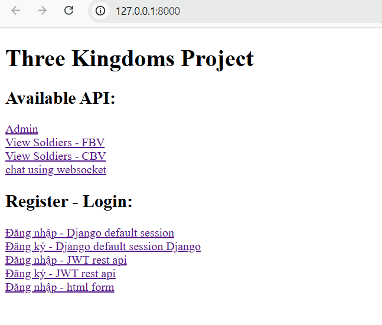

# Demo project

### Key Features:
- View using fbv and cbv
- User authentication using JWT-based login and session
- Real-time messaging/chat using WebSocket
run server Daphne: daphne ThreeKingdoms.asgi:application
- RESTful API for CRUD operations

## Homepage

